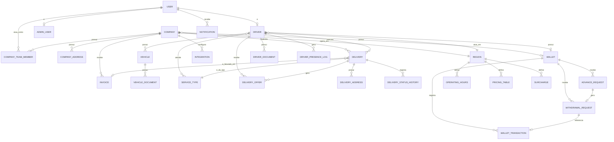

# MOTOboyCity — Fase 2A: Modelagem Conceitual do Domínio

> Status: **proposta para revisão** — nada aqui foi implementado. Nenhum `schema.prisma` foi criado ou alterado, nenhuma migration foi executada, nenhuma tabela foi criada no Neon.
>
> Convenção de referência usada na coluna "Origem" das tabelas de campos:
> **[Motoboy]** = `app do motoboy.pdf` · **[Admin]** = `area adm do sistema.pdf` · **[Empresa]** = `area da empresa parceira.pdf` · **[Inferido]** = não observado diretamente nos prints, deduzido da necessidade funcional (marcado para validação).

---

## 1. Resumo executivo

O modelo proposto organiza o domínio em 7 blocos: **Identidade/Acesso**, **Empresa**, **Entregador**, **Pedido**, **Financeiro**, **Configuração/Plataforma** e **Integrações/Notificações**, totalizando **26 entidades persistentes propostas**.

Decisões estruturais centrais desta proposta:

1. **Identidade unificada (`User`)**: em vez de cada perfil (empresa, entregador, admin) carregar seu próprio login, uma entidade `User` genérica concentra autenticação/contato, e `Driver`, `CompanyTeamMember` e `AdminUser` são perfis especializados ligados a ela. Isso evita duplicar lógica de credencial três vezes e já acomoda o fato de a Empresa ter múltiplos usuários ("Equipe").
2. **Carteira como razão contábil (ledger), nunca saldo mutável**: `Wallet` não guarda saldo editável diretamente — saldo disponível/bloqueado é **derivado** de `WalletTransaction` (registro append-only). Isso atende à exigência explícita de auditabilidade financeira.
3. **Fila de entregadores fora do Postgres**: a fila ao vivo (ordem, presença online, "recarregar posição") é, por natureza, estado efêmero de alta frequência de escrita — recomendo Redis, não uma tabela `DriverQueue`. Para auditoria e métricas (tempo médio de aceite, taxa de recusa), proponho duas entidades leves e persistentes: `DeliveryOffer` (cada oferta de pedido a um entregador) e `DriverPresenceLog` (sessões online/offline).
4. **Documentos são metadados, não arquivos**: `DriverDocument` e `VehicleDocument` (nova, separada por dono) guardam apenas referência ao arquivo externo (ImageKit) + status de revisão — nunca binário.
5. **"Retorno ao Local de Coleta" permanece em aberto**: não assumi uma modelagem definitiva para essa etapa — apresento 3 alternativas na seção 15 e preciso da sua decisão antes da Fase 2B.
6. **9 questões estão marcadas como pendentes de aprovação humana** antes de qualquer schema Prisma ser escrito (seção 15).

Esta proposta introduz **5 entidades novas** além das candidatas da Fase 0 (`User`, `AdminUser`, `VehicleDocument`, `DeliveryOffer`, `DriverPresenceLog`) e **descarta/funde 4** das candidatas originais (detalhes na seção 4).

---

## 2. Diagrama geral das entidades



---

## 3. Entidades aprovadas para modelagem

### Identidade / Acesso

| Entidade            | Objetivo                                                            | Persistente | Observações                                                                                                     |
| ------------------- | ------------------------------------------------------------------- | ----------- | --------------------------------------------------------------------------------------------------------------- |
| `User`              | Identidade de autenticação genérica (e-mail, senha, telefone, tipo) | Sim         | **Nova** — não existia como candidata da Fase 0                                                                 |
| `AdminUser`         | Perfil de um funcionário da plataforma com acesso ao admin-web      | Sim         | **Nova** — necessária pois o admin-web claramente exige login e atribuição de ações (quem aprovou, quem editou) |
| `CompanyTeamMember` | Vínculo entre um `User` e uma `Company`, com papel                  | Sim         | Redefinida: não é mais "usuário autocontido", é join                                                            |

### Empresa

| Entidade         | Objetivo                                                           | Persistente | Observações                                     |
| ---------------- | ------------------------------------------------------------------ | ----------- | ----------------------------------------------- |
| `Company`        | Cadastro da empresa parceira                                       | Sim         |                                                 |
| `CompanyAddress` | Endereços da empresa (inclui o de coleta principal e os favoritos) | Sim         | Endereço principal = linha com `isPrimary=true` |

### Entregador

| Entidade            | Objetivo                                       | Persistente | Observações                                                        |
| ------------------- | ---------------------------------------------- | ----------- | ------------------------------------------------------------------ |
| `Driver`            | Perfil do entregador                           | Sim         |                                                                    |
| `Vehicle`           | Veículo(s) do entregador                       | Sim         | Ver decisão de cardinalidade na seção 15                           |
| `DriverDocument`    | Metadados de documentos pessoais do entregador | Sim         | Selfie, RG, CNH frente/verso, comprovante de endereço              |
| `VehicleDocument`   | Metadados de documentos do veículo             | Sim         | **Nova** — CRLV e foto traseira pertencem ao veículo, não à pessoa |
| `DriverPresenceLog` | Sessões de presença online/offline             | Sim         | **Nova** — para relatórios; não é a fila ao vivo                   |

### Pedido

| Entidade                | Objetivo                                            | Persistente | Observações                                           |
| ----------------------- | --------------------------------------------------- | ----------- | ----------------------------------------------------- |
| `Delivery`              | O pedido/entrega em si                              | Sim         |                                                       |
| `DeliveryAddress`       | Endereço de coleta e de entrega de um pedido        | Sim         | Snapshot no momento do pedido, não referência mutável |
| `DeliveryStatusHistory` | Trilha de auditoria de mudança de status            | Sim         | Fonte de verdade para tempos médios                   |
| `DeliveryOffer`         | Cada oferta de um pedido a um entregador específico | Sim         | **Nova** — ver justificativa na seção 6               |

### Financeiro

| Entidade            | Objetivo                                           | Persistente | Observações                                                   |
| ------------------- | -------------------------------------------------- | ----------- | ------------------------------------------------------------- |
| `Wallet`            | Carteira (de empresa ou de entregador)             | Sim         | Saldo é **derivado**, não armazenado como campo mutável solto |
| `WalletTransaction` | Lançamento financeiro (ledger append-only)         | Sim         | Fonte de verdade do saldo                                     |
| `WithdrawalRequest` | Solicitação de saque                               | Sim         |                                                               |
| `AdvanceRequest`    | Solicitação de antecipação                         | Sim         | Pode gerar uma `WithdrawalRequest` automaticamente            |
| `Invoice`           | Fatura que agrupa pedidos faturados de uma empresa | Sim         | Valores congelados na emissão                                 |

### Configuração / Plataforma

| Entidade         | Objetivo                                           | Persistente | Observações                                                           |
| ---------------- | -------------------------------------------------- | ----------- | --------------------------------------------------------------------- |
| `ServiceType`    | Tipos de serviço oferecidos (ex.: motoboy)         | Sim         | Evita fixar "motoboy" como string solta                               |
| `Region`         | Praça/região de operação                           | Sim         | Fusão de "Region" + "OperatingArea" da Fase 0                         |
| `OperatingHours` | Horário de funcionamento por região                | Sim         | 1 linha por dia da semana                                             |
| `PricingTable`   | Tabela de preços base por região + tipo de serviço | Sim         | Sem motor de cálculo implementado                                     |
| `Surcharge`      | Sobretaxa configurável (chuva, pico, etc.)         | Sim         | **Nova** — fusão/generalização de "Tarifa Dinâmica" + "Taxa de Chuva" |

### Integrações / Notificações

| Entidade       | Objetivo                                   | Persistente | Observações                                            |
| -------------- | ------------------------------------------ | ----------- | ------------------------------------------------------ |
| `Integration`  | Conexão configurada com um serviço externo | Sim         | Credenciais **não** ficam em texto puro (ver seção 14) |
| `Notification` | Notificação persistida (push/realtime)     | Sim         | Vinculada a `User`                                     |

**Total: 26 entidades.**

---

## 4. Entidades descartadas / fundidas

| Candidata original | Decisão                             | Motivo                                                                                                                                                                                                                                                                                          |
| ------------------ | ----------------------------------- | ----------------------------------------------------------------------------------------------------------------------------------------------------------------------------------------------------------------------------------------------------------------------------------------------- |
| `DriverQueue`      | **Descartada como tabela Postgres** | É estado de altíssima frequência de mutação (posição na fila muda a cada segundo/evento). Persistir cada mudança geraria escrita excessiva sem valor de auditoria proporcional. Recomendo Redis (ver seção 12) + `DeliveryOffer`/`DriverPresenceLog` para o que realmente precisa de histórico. |
| `OperatingArea`    | **Fundida em `Region`**             | Mesma coisa que "praça" — manter os dois nomes criaria ambiguidade sem ganho de modelagem.                                                                                                                                                                                                      |
| `Tariff`           | **Fundida em `Surcharge`**          | "Tarifa Dinâmica" e "Taxa de Chuva" são instâncias do mesmo conceito (um modificador condicional sobre o preço base). Modelar como entidade genérica evita criar uma tabela nova a cada novo tipo de sobretaxa que o produto inventar.                                                          |
| `Payment`          | **Não criada agora**                | Não há evidência nos prints de pagamento parcial/múltiplo por fatura (uma fatura tem uma única "Data de Pagamento"). Os campos de pagamento ficam diretamente em `Invoice`. Se pagamentos parciais forem necessários no futuro, esta decisão deve ser revisitada — ver seção 15.                |

---

## 5. Campos por entidade

### `User` _(nova)_

| Campo            | Tipo conceitual | Obrigatório? | Descrição                                     | Origem                     | Observação                                       |
| ---------------- | --------------- | ------------ | --------------------------------------------- | -------------------------- | ------------------------------------------------ |
| id               | UUID            | Sim          | Identificador                                 | —                          |                                                  |
| type             | ENUM(UserType)  | Sim          | COMPANY_MEMBER / DRIVER / ADMIN               | [Inferido]                 | Discriminador — um `User` não pode mudar de tipo |
| name             | STRING          | Sim          | Nome completo                                 | [Motoboy][Empresa]         |                                                  |
| email            | STRING (único)  | Sim          | E-mail de login                               | [Motoboy][Empresa]         |                                                  |
| phone            | STRING          | Sim          | Telefone                                      | [Motoboy][Empresa]         |                                                  |
| passwordHash     | STRING          | Sim          | Hash da senha                                 | [Inferido]                 | Nunca texto puro                                 |
| avatarDocumentId | UUID (FK)       | Não          | Referência a arquivo externo (foto de perfil) | [Motoboy] "Atualizar Foto" |                                                  |
| createdAt        | DATETIME        | Sim          |                                               | —                          |                                                  |

### `AdminUser` _(nova)_

| Campo            | Tipo conceitual  | Obrigatório? | Descrição              | Origem     | Observação                                     |
| ---------------- | ---------------- | ------------ | ---------------------- | ---------- | ---------------------------------------------- |
| id               | UUID             | Sim          |                        | —          |                                                |
| userId           | UUID (FK, único) | Sim          | Vínculo 1:1 com `User` | [Inferido] |                                                |
| level/department | STRING           | Não          | Nível de permissão     | [Inferido] | Sem tela de permissões capturada — placeholder |

### `CompanyTeamMember`

| Campo     | Tipo conceitual         | Obrigatório? | Descrição        | Origem               | Observação |
| --------- | ----------------------- | ------------ | ---------------- | -------------------- | ---------- |
| id        | UUID                    | Sim          |                  | —                    |            |
| companyId | UUID (FK)               | Sim          |                  | [Admin] "Equipe (0)" |            |
| userId    | UUID (FK)               | Sim          |                  | [Inferido]           |            |
| role      | ENUM(CompanyMemberRole) | Sim          | OWNER / OPERATOR | [Inferido]           |            |
| status    | ENUM(ACTIVE, INACTIVE)  | Sim          |                  | [Inferido]           |            |
| joinedAt  | DATETIME                | Sim          |                  | —                    |            |

### `Company`

| Campo     | Tipo conceitual     | Obrigatório? | Descrição                             | Origem                          | Observação |
| --------- | ------------------- | ------------ | ------------------------------------- | ------------------------------- | ---------- |
| id        | UUID                | Sim          |                                       | —                               |            |
| legalName | STRING              | Sim          | Razão Social                          | [Empresa] cadastro              |            |
| tradeName | STRING              | Sim          | Nome Fantasia                         | [Empresa] cadastro              |            |
| document  | STRING              | Sim          | CPF/CNPJ                              | [Empresa] cadastro              |            |
| status    | ENUM(CompanyStatus) | Sim          | PENDING_APPROVAL / ACTIVE / SUSPENDED | [Empresa] "cadastro em análise" |            |
| regionId  | UUID (FK)           | Sim          |                                       | [Inferido]                      |            |
| createdAt | DATETIME            | Sim          |                                       | —                               |            |

### `CompanyAddress`

| Campo                                        | Tipo conceitual | Obrigatório?            | Descrição                 | Origem                                 | Observação                              |
| -------------------------------------------- | --------------- | ----------------------- | ------------------------- | -------------------------------------- | --------------------------------------- |
| id                                           | UUID            | Sim                     |                           | —                                      |                                         |
| companyId                                    | UUID (FK)       | Sim                     |                           | [Admin] "Endereços Favoritos"          |                                         |
| label                                        | STRING          | Não                     | Apelido do endereço       | [Inferido]                             |                                         |
| street, number, complement, city, state, zip | STRING          | Sim (exceto complement) |                           | [Motoboy] padrão de endereço           | Mesmo padrão usado em `DeliveryAddress` |
| lat, lng                                     | DECIMAL         | Não                     | Geolocalização            | [Empresa] mapa                         |                                         |
| isPrimary                                    | BOOLEAN         | Sim                     | Endereço padrão de coleta | [Empresa] "Coleta no endereço da loja" |                                         |

### `Driver`

| Campo            | Tipo conceitual            | Obrigatório? | Descrição                            | Origem                             | Observação                                 |
| ---------------- | -------------------------- | ------------ | ------------------------------------ | ---------------------------------- | ------------------------------------------ |
| id               | UUID                       | Sim          |                                      | —                                  |                                            |
| userId           | UUID (FK, único)           | Sim          |                                      | [Inferido]                         |                                            |
| cpf              | STRING                     | Sim          |                                      | [Motoboy] cadastro                 |                                            |
| birthDate        | DATE                       | Sim          |                                      | [Motoboy] cadastro/perfil          |                                            |
| pixKey           | STRING                     | Sim          |                                      | [Motoboy] cadastro                 |                                            |
| pixKeyType       | ENUM                       | Sim          | Email, CPF, etc.                     | [Motoboy] cadastro                 |                                            |
| hasCnpj          | BOOLEAN                    | Sim          | "Possui CNPJ?"                       | [Motoboy] cadastro                 |                                            |
| regionId         | UUID (FK)                  | Sim          |                                      | [Inferido]                         | Usado para filas/relatórios por região     |
| approvalStatus   | ENUM(DriverApprovalStatus) | Sim          | PENDING / APPROVED / REJECTED        | [Admin] "Entregadores Pendentes"   | Conceito separado de accountStatus         |
| accountStatus    | ENUM(DriverAccountStatus)  | Sim          | ACTIVE / SUSPENDED / BLOCKED         | [Admin] badge "Suspenso"           | Conceito separado de approvalStatus        |
| availability     | ENUM(DriverAvailability)   | Sim          | AVAILABLE / UNAVAILABLE              | [Motoboy] toggle "Ativo"           | Controlado pelo próprio entregador         |
| appVersion       | STRING                     | Não          |                                      | [Admin] "Versão do App"            |                                            |
| lastKnownLat/Lng | DECIMAL                    | Não          | Última localização conhecida (cache) | [Admin] mapa, "Último local: há X" | **Cache**, não histórico — ver seção 11/12 |
| lastSeenAt       | DATETIME                   | Não          |                                      | [Admin] "Último local: há X"       |                                            |
| createdAt        | DATETIME                   | Sim          |                                      | —                                  |                                            |

### `Vehicle`

| Campo         | Tipo conceitual      | Obrigatório? | Descrição                              | Origem             | Observação                                   |
| ------------- | -------------------- | ------------ | -------------------------------------- | ------------------ | -------------------------------------------- |
| id            | UUID                 | Sim          |                                        | —                  |                                              |
| driverId      | UUID (FK)            | Sim          |                                        | [Motoboy] cadastro |                                              |
| plate         | STRING               | Sim          | Placa                                  | [Motoboy] cadastro |                                              |
| city          | STRING               | Sim          | Cidade do veículo                      | [Motoboy] cadastro |                                              |
| color         | STRING               | Sim          | Cor                                    | [Motoboy] cadastro |                                              |
| type          | ENUM/FK(ServiceType) | Sim          | "Tipo do Veículo" (dropdown "motoboy") | [Motoboy] cadastro | Ver seção 15 sobre relação com `ServiceType` |
| hasBagOrTrunk | BOOLEAN              | Sim          | "Possui Bag ou Baú?"                   | [Motoboy] cadastro |                                              |
| status        | ENUM(VehicleStatus)  | Sim          | ACTIVE / INACTIVE                      | [Inferido]         | Regra: só 1 ACTIVE por `Driver` por vez      |
| createdAt     | DATETIME             | Sim          |                                        | —                  |                                              |

### `DriverDocument`

| Campo                   | Tipo conceitual            | Obrigatório? | Descrição                                         | Origem                          | Observação                 |
| ----------------------- | -------------------------- | ------------ | ------------------------------------------------- | ------------------------------- | -------------------------- |
| id                      | UUID                       | Sim          |                                                   | —                               |                            |
| driverId                | UUID (FK)                  | Sim          |                                                   | [Motoboy] cadastro              |                            |
| type                    | ENUM(DriverDocumentType)   | Sim          | SELFIE, RG, CNH_FRONT, CNH_BACK, PROOF_OF_ADDRESS | [Motoboy] cadastro              |                            |
| externalFileId          | STRING                     | Sim          | Identificador no ImageKit                         | [Inferido]                      |                            |
| url                     | STRING                     | Sim          |                                                   | [Inferido]                      |                            |
| reviewStatus            | ENUM(DocumentReviewStatus) | Sim          | PENDING_REVIEW / APPROVED / REJECTED              | [Admin] aprovação de entregador |                            |
| reviewedByAdminUserId   | UUID (FK)                  | Não          |                                                   | [Inferido]                      | Preenchido quando revisado |
| rgIssuer                | STRING                     | Condicional  | Órgão emissor (só para tipo=RG)                   | [Motoboy] cadastro              | Ver observação abaixo      |
| cnhNumber, cnhExpiresAt | STRING/DATE                | Condicional  | Só para tipo=CNH                                  | [Motoboy] cadastro              |                            |
| cnhIsPaidActivity       | BOOLEAN                    | Condicional  | "CNH com atividade remunerada?"                   | [Motoboy] cadastro              |                            |
| createdAt               | DATETIME                   | Sim          |                                                   | —                               |                            |

> Observação: campos "condicionais" (`rgIssuer`, `cnhNumber`, etc.) só fazem sentido para tipos específicos de documento — isso é um sinal de que, na Fase 2B, pode valer a pena separar `DriverDocument` (arquivo genérico) de um `DriverIdentityInfo` (dados textuais de RG/CNH que não são arquivo). Estou sinalizando aqui, mas não vou decidir estrutura de tabela agora — é decisão de schema, não de modelo conceitual.

### `VehicleDocument` _(nova)_

| Campo               | Tipo conceitual            | Obrigatório? | Descrição                | Origem                                             | Observação |
| ------------------- | -------------------------- | ------------ | ------------------------ | -------------------------------------------------- | ---------- |
| id                  | UUID                       | Sim          |                          | —                                                  |            |
| vehicleId           | UUID (FK)                  | Sim          |                          | [Motoboy] cadastro                                 |            |
| type                | ENUM(VehicleDocumentType)  | Sim          | CRLV, VEHICLE_BACK_PHOTO | [Motoboy] cadastro ("CRVL", "Traseira do Veículo") |            |
| externalFileId, url | STRING                     | Sim          |                          | [Inferido]                                         |            |
| reviewStatus        | ENUM(DocumentReviewStatus) | Sim          |                          | [Admin]                                            |            |
| createdAt           | DATETIME                   | Sim          |                          | —                                                  |            |

### `DriverPresenceLog` _(nova)_

| Campo         | Tipo conceitual | Obrigatório? | Descrição            | Origem                        | Observação |
| ------------- | --------------- | ------------ | -------------------- | ----------------------------- | ---------- |
| id            | UUID            | Sim          |                      | —                             |            |
| driverId      | UUID (FK)       | Sim          |                      | [Inferido]                    |            |
| wentOnlineAt  | DATETIME        | Sim          |                      | [Admin] "Entregadores Online" |            |
| wentOfflineAt | DATETIME        | Não          | Nulo enquanto online | [Inferido]                    |            |

### `Delivery`

| Campo                          | Tipo conceitual      | Obrigatório? | Descrição                                      | Origem                        | Observação                          |
| ------------------------------ | -------------------- | ------------ | ---------------------------------------------- | ----------------------------- | ----------------------------------- |
| id                             | UUID                 | Sim          |                                                | —                             |                                     |
| displayNumber                  | INTEGER (único)      | Sim          | Número visível (#23249)                        | [Admin][Motoboy]              | Sequencial, distinto da PK          |
| companyId                      | UUID (FK)            | Sim          |                                                | [Admin][Empresa]              |                                     |
| driverId                       | UUID (FK)            | Não          | Nulo até aceite                                | [Admin]                       |                                     |
| serviceTypeId                  | UUID (FK)            | Sim          |                                                | [Motoboy] pedido "motoboy"    |                                     |
| status                         | ENUM(DeliveryStatus) | Sim          | Ver seção 8                                    | [Admin] colunas do dashboard  | Denormalizado para leitura rápida   |
| statusChangedAt                | DATETIME             | Sim          | Carimbo do status atual                        | [Inferido]                    | Complementa `DeliveryStatusHistory` |
| scheduledAt                    | DATETIME             | Não          | Preenchido só se agendado                      | [Motoboy] "Pedidos Agendados" |                                     |
| distanceKm                     | DECIMAL              | Não          |                                                | [Admin] "0,00 km"             |                                     |
| totalValue                     | DECIMAL              | Sim          | Valor cobrado da empresa                       | [Admin]                       |                                     |
| driverValue                    | DECIMAL              | Sim          | Valor pago ao entregador                       | [Admin][Motoboy]              |                                     |
| platformValue                  | DECIMAL              | Sim          | Comissão da plataforma                         | [Admin] "(x R$ 0,60)"         |                                     |
| paymentMethod                  | ENUM(PaymentMethod)  | Sim          | FATURADO / ONLINE                              | [Admin] "Faturado"            |                                     |
| invoiceId                      | UUID (FK)            | Não          | Nulo até faturamento                           | [Admin] "Pendentes de Fatura" |                                     |
| requiresDeliveryProof          | BOOLEAN              | Não          | "comprovante de entrega"                       | [Empresa] "Lançar Pedido"     |                                     |
| requiresCollectionRecipient    | BOOLEAN              | Não          | "recebimento necessário"                       | [Empresa] "Lançar Pedido"     |                                     |
| pickupSurchargeChargedToDriver | BOOLEAN              | Não          | "Cobrar sobretaxa da coleta para o entregador" | [Empresa] "Lançar Pedido"     |                                     |
| createdAt                      | DATETIME             | Sim          |                                                | —                             |                                     |

### `DeliveryAddress`

| Campo                                        | Tipo conceitual       | Obrigatório?            | Descrição                        | Origem                    | Observação                                                      |
| -------------------------------------------- | --------------------- | ----------------------- | -------------------------------- | ------------------------- | --------------------------------------------------------------- |
| id                                           | UUID                  | Sim                     |                                  | —                         |                                                                 |
| deliveryId                                   | UUID (FK)             | Sim                     |                                  | [Empresa] "Lançar Pedido" |                                                                 |
| type                                         | ENUM(PICKUP, DROPOFF) | Sim                     |                                  | [Inferido]                | Normalmente 2 linhas por pedido                                 |
| street, number, complement, city, state, zip | STRING                | Sim (exceto complement) |                                  | [Empresa][Admin]          | Snapshot — não referencia `CompanyAddress` diretamente          |
| lat, lng                                     | DECIMAL               | Não                     |                                  | [Admin] mapa              |                                                                 |
| referenceNote                                | STRING                | Não                     | "Definido no momento da entrega" | [Admin]                   | Endereço de entrega pode não existir ainda no momento da coleta |

### `DeliveryStatusHistory`

| Campo           | Tipo conceitual      | Obrigatório? | Descrição                                    | Origem                       | Observação              |
| --------------- | -------------------- | ------------ | -------------------------------------------- | ---------------------------- | ----------------------- |
| id              | UUID                 | Sim          |                                              | —                            |                         |
| deliveryId      | UUID (FK)            | Sim          |                                              | [Inferido]                   |                         |
| fromStatus      | ENUM(DeliveryStatus) | Não          | Nulo na primeira linha                       | [Inferido]                   |                         |
| toStatus        | ENUM(DeliveryStatus) | Sim          |                                              | [Inferido]                   |                         |
| changedAt       | DATETIME             | Sim          |                                              | [Admin] timestamps por etapa | Base para tempos médios |
| changedByUserId | UUID (FK)            | Não          | Quem/o quê originou (sistema, driver, admin) | [Inferido]                   |                         |
| note            | STRING               | Não          | Ex.: motivo de cancelamento                  | [Inferido]                   |                         |

### `DeliveryOffer` _(nova)_

| Campo       | Tipo conceitual             | Obrigatório? | Descrição                               | Origem                                                    | Observação |
| ----------- | --------------------------- | ------------ | --------------------------------------- | --------------------------------------------------------- | ---------- |
| id          | UUID                        | Sim          |                                         | —                                                         |            |
| deliveryId  | UUID (FK)                   | Sim          |                                         | [Inferido]                                                |            |
| driverId    | UUID (FK)                   | Sim          |                                         | [Inferido]                                                |            |
| offeredAt   | DATETIME                    | Sim          |                                         | [Empresa] "AnyFone" — "chamar entregador após X segundos" |            |
| respondedAt | DATETIME                    | Não          |                                         | [Inferido]                                                |            |
| response    | ENUM(DeliveryOfferResponse) | Sim          | PENDING / ACCEPTED / DECLINED / EXPIRED | [Inferido]                                                |            |

> Justificativa: sem esta entidade, não é possível calcular "tempo médio de aceite" com precisão (o `Delivery` só sabe quando foi finalmente aceito, não quantos entregadores recusaram antes), nem explicar/auditar por que um pedido demorou para ser aceito. Também dá suporte direto à configuração vista em [Empresa] "chamar entregador após X segundos".

### `Wallet`

| Campo                  | Tipo conceitual | Obrigatório? | Descrição                                           | Origem                      | Observação                                                        |
| ---------------------- | --------------- | ------------ | --------------------------------------------------- | --------------------------- | ----------------------------------------------------------------- |
| id                     | UUID            | Sim          |                                                     | —                           |                                                                   |
| companyId              | UUID (FK, nulo) | Condicional  | Exatamente um entre companyId/driverId deve existir | [Admin][Motoboy] "Carteira" |                                                                   |
| driverId               | UUID (FK, nulo) | Condicional  |                                                     | [Admin][Motoboy] "Carteira" |                                                                   |
| cachedAvailableBalance | DECIMAL         | Não          | Snapshot otimizado do saldo disponível              | [Inferido]                  | **Derivado** de `WalletTransaction` — cache, não fonte de verdade |
| cachedBlockedBalance   | DECIMAL         | Não          | Snapshot otimizado do saldo bloqueado               | [Inferido]                  | Idem                                                              |

### `WalletTransaction`

| Campo                      | Tipo conceitual               | Obrigatório? | Descrição                                                                                                               | Origem                                      | Observação |
| -------------------------- | ----------------------------- | ------------ | ----------------------------------------------------------------------------------------------------------------------- | ------------------------------------------- | ---------- |
| id                         | UUID                          | Sim          |                                                                                                                         | —                                           |            |
| walletId                   | UUID (FK)                     | Sim          |                                                                                                                         | [Admin][Motoboy]                            |            |
| type                       | ENUM(WalletTransactionType)   | Sim          | CREDIT_REPASSE, DEBIT_WITHDRAWAL, DEBIT_FEE, CREDIT_ADVANCE_RELEASE, CREDIT_ADJUSTMENT, DEBIT_ADJUSTMENT, CREDIT_REFUND | [Motoboy] "Repasse automático do pedido #N" |            |
| status                     | ENUM(WalletTransactionStatus) | Sim          | PENDING / RELEASED / CANCELLED                                                                                          | [Motoboy] badge "Aguardando"                |            |
| amount                     | DECIMAL                       | Sim          | Sempre positivo; sinal dado por `type`                                                                                  | [Motoboy][Admin]                            |            |
| relatedDeliveryId          | UUID (FK)                     | Não          |                                                                                                                         | [Motoboy] "pedido #23247"                   |            |
| relatedWithdrawalRequestId | UUID (FK)                     | Não          |                                                                                                                         | [Inferido]                                  |            |
| relatedAdvanceRequestId    | UUID (FK)                     | Não          |                                                                                                                         | [Inferido]                                  |            |
| releaseAt                  | DATETIME                      | Não          | "Liberação em 09/08 00:00"                                                                                              | [Motoboy] Carteira                          |            |
| notaFiscal                 | STRING                        | Não          |                                                                                                                         | [Admin] Carteira Digital do entregador      |            |
| createdAt                  | DATETIME                      | Sim          |                                                                                                                         | —                                           |            |

### `WithdrawalRequest`

| Campo                                                | Tipo conceitual               | Obrigatório? | Descrição                                | Origem                     | Observação                       |
| ---------------------------------------------------- | ----------------------------- | ------------ | ---------------------------------------- | -------------------------- | -------------------------------- |
| id                                                   | UUID                          | Sim          |                                          | —                          |                                  |
| walletId                                             | UUID (FK)                     | Sim          |                                          | [Motoboy] "Resgatar Saldo" |                                  |
| requestedAmount                                      | DECIMAL                       | Sim          |                                          | [Motoboy]                  |                                  |
| feeAmount                                            | DECIMAL                       | Sim          | Taxa administrativa (3.0% no print)      | [Motoboy]                  |                                  |
| netAmount                                            | DECIMAL                       | Sim          |                                          | [Motoboy]                  |                                  |
| bankName, bankAgency, bankAccount, accountHolderName | STRING                        | Sim          | Snapshot no momento da solicitação       | [Motoboy] "Resgatar Saldo" | Ver questão em aberto (seção 15) |
| pixKey, pixKeyType                                   | STRING                        | Não          |                                          | [Motoboy] "Resgatar Saldo" |                                  |
| status                                               | ENUM(WithdrawalRequestStatus) | Sim          | PENDING / APPROVED / PAID / REJECTED     | [Admin] badge "Aprovado"   |                                  |
| walletTransactionId                                  | UUID (FK)                     | Sim          | Lançamento que efetivamente move o saldo | [Inferido]                 |                                  |
| createdAt                                            | DATETIME                      | Sim          |                                          | —                          |                                  |

### `AdvanceRequest`

| Campo                        | Tipo conceitual            | Obrigatório? | Descrição                                | Origem                                        | Observação |
| ---------------------------- | -------------------------- | ------------ | ---------------------------------------- | --------------------------------------------- | ---------- |
| id                           | UUID                       | Sim          |                                          | —                                             |            |
| walletId                     | UUID (FK)                  | Sim          |                                          | [Motoboy] "Solicitar Antecipação"             |            |
| blockedAmountAntecipado      | DECIMAL                    | Sim          | Valor bloqueado antecipado               | [Motoboy]                                     |            |
| feeAmount                    | DECIMAL                    | Sim          | Taxa de antecipação (3.0% no print)      | [Motoboy]                                     |            |
| netAmount                    | DECIMAL                    | Sim          | Valor líquido, vira solicitação de saque | [Motoboy] "enviado como solicitação de saque" |            |
| status                       | ENUM(AdvanceRequestStatus) | Sim          | PENDING / APPROVED / REJECTED            | [Inferido]                                    |            |
| resultingWithdrawalRequestId | UUID (FK)                  | Não          | Preenchido ao aprovar                    | [Motoboy] texto explicativo                   |            |
| createdAt                    | DATETIME                   | Sim          |                                          | —                                             |            |

### `Invoice`

| Campo            | Tipo conceitual     | Obrigatório? | Descrição                            | Origem                               | Observação                                               |
| ---------------- | ------------------- | ------------ | ------------------------------------ | ------------------------------------ | -------------------------------------------------------- |
| id               | UUID                | Sim          |                                      | —                                    |                                                          |
| companyId        | UUID (FK)           | Sim          |                                      | [Admin] "Faturas"                    |                                                          |
| number           | STRING (único)      | Sim          | "FAT-2026-0302"                      | [Admin] "Extrato de Recebimentos"    |                                                          |
| issueDate        | DATE                | Sim          |                                      | [Admin] "Faturas"                    |                                                          |
| dueDate          | DATE                | Sim          |                                      | [Admin] "Faturas"                    |                                                          |
| paymentDate      | DATE                | Não          |                                      | [Admin] "Faturas"                    |                                                          |
| paymentMethod    | ENUM(PaymentMethod) | Não          |                                      | [Admin] "Faturas"                    |                                                          |
| status           | ENUM(InvoiceStatus) | Sim          | PENDING / PAID / OVERDUE / CANCELLED | [Admin] "Faturas Pendentes/Vencidas" |                                                          |
| totalValue       | DECIMAL             | Sim          | **Congelado** na emissão             | [Admin] "Faturas"                    | Não recalcular a partir dos `Delivery` depois de emitida |
| driverValueSum   | DECIMAL             | Sim          | **Congelado**                        | [Admin] Resumo do Pagamento          | Informativo                                              |
| platformValueSum | DECIMAL             | Sim          | **Congelado**                        | [Admin] "Total de Comissão"          |                                                          |
| createdAt        | DATETIME            | Sim          |                                      | —                                    |                                                          |

### `ServiceType`

| Campo  | Tipo conceitual | Obrigatório? | Descrição        | Origem           | Observação |
| ------ | --------------- | ------------ | ---------------- | ---------------- | ---------- |
| id     | UUID            | Sim          |                  | —                |            |
| code   | STRING (único)  | Sim          | "motoboy"        | [Admin][Motoboy] |            |
| name   | STRING          | Sim          | Nome de exibição | [Inferido]       |            |
| active | BOOLEAN         | Sim          |                  | [Inferido]       |            |

> Relação `Driver` ↔ `ServiceType`: proponho M:N via tabela de junção `DriverServiceType` (driverId, serviceTypeId, isPrimary) para permitir que um entregador atenda mais de uma modalidade no futuro (moto e bike, por exemplo), embora hoje na prática cada entregador tenha um único tipo.

### `Region`

| Campo                 | Tipo conceitual | Obrigatório? | Descrição               | Origem                | Observação |
| --------------------- | --------------- | ------------ | ----------------------- | --------------------- | ---------- |
| id                    | UUID            | Sim          |                         | —                     |            |
| name                  | STRING          | Sim          | Ex.: "Lajinha"          | [Admin][Motoboy] mapa |            |
| maxDeliveryDistanceKm | DECIMAL         | Não          | "Distâncias Permitidas" | [Admin] Configurações |            |
| active                | BOOLEAN         | Sim          |                         | [Inferido]            |            |

### `OperatingHours`

| Campo             | Tipo conceitual | Obrigatório? | Descrição | Origem                             | Observação |
| ----------------- | --------------- | ------------ | --------- | ---------------------------------- | ---------- |
| id                | UUID            | Sim          |           | —                                  |            |
| regionId          | UUID (FK)       | Sim          |           | [Admin] "Horário de Funcionamento" |            |
| weekday           | ENUM/INTEGER    | Sim          | 0–6       | [Inferido]                         |            |
| opensAt, closesAt | TIME            | Sim          |           | [Inferido]                         |            |

### `PricingTable`

| Campo         | Tipo conceitual | Obrigatório? | Descrição | Origem                     | Observação                             |
| ------------- | --------------- | ------------ | --------- | -------------------------- | -------------------------------------- |
| id            | UUID            | Sim          |           | —                          |                                        |
| regionId      | UUID (FK)       | Sim          |           | [Admin] "Tabela de Preços" |                                        |
| serviceTypeId | UUID (FK)       | Sim          |           | [Admin] "Tabela de Preços" |                                        |
| baseFee       | DECIMAL         | Sim          |           | [Inferido]                 | Sem motor de cálculo — só persistência |
| perKmFee      | DECIMAL         | Sim          |           | [Inferido]                 |                                        |
| minimumFee    | DECIMAL         | Não          |           | [Inferido]                 |                                        |

### `Surcharge` _(nova)_

| Campo    | Tipo conceitual     | Obrigatório? | Descrição                                       | Origem                                    | Observação |
| -------- | ------------------- | ------------ | ----------------------------------------------- | ----------------------------------------- | ---------- |
| id       | UUID                | Sim          |                                                 | —                                         |            |
| regionId | UUID (FK)           | Sim          |                                                 | [Admin] "Tarifa Dinâmica"/"Taxa de Chuva" |            |
| type     | ENUM(SurchargeType) | Sim          | RAIN / PEAK_HOUR / OTHER                        | [Admin]                                   |            |
| value    | DECIMAL             | Sim          | Valor fixo ou percentual (a definir na Fase 2B) | [Admin]                                   |            |
| active   | BOOLEAN             | Sim          |                                                 | [Inferido]                                |            |

### `Integration`

| Campo                   | Tipo conceitual           | Obrigatório? | Descrição                                                                                  | Origem                              | Observação                         |
| ----------------------- | ------------------------- | ------------ | ------------------------------------------------------------------------------------------ | ----------------------------------- | ---------------------------------- |
| id                      | UUID                      | Sim          |                                                                                            | —                                   |                                    |
| companyId               | UUID (FK, nulo)           | Não          | Nulo = integração de catálogo, não conectada ainda                                         | [Empresa][Admin] "Integrações"      |                                    |
| provider                | ENUM(IntegrationProvider) | Sim          | IFOOD, ANYFONE, PDV_INTEGRADO, DELIVERY_MUCH, JA_DELIVERY, CARDAPIO_WEB, ANOTA_AI, AIQFOME | [Empresa] "Integrações Disponíveis" |                                    |
| status                  | ENUM(IntegrationStatus)   | Sim          | DISCONNECTED / CONNECTED / ERROR                                                           | [Inferido]                          |                                    |
| config                  | JSON                      | Não          | Configurações não sensíveis (ex.: timeout de chamada)                                      | [Empresa] "AnyFone"                 |                                    |
| credentialsRef          | STRING                    | Não          | **Referência** a segredo em cofre externo                                                  | [Inferido]                          | Nunca o token em si — ver seção 14 |
| connectedAt, lastSyncAt | DATETIME                  | Não          |                                                                                            | [Inferido]                          |                                    |

### `Notification`

| Campo                              | Tipo conceitual           | Obrigatório? | Descrição                                                                                                                                        | Origem                           | Observação |
| ---------------------------------- | ------------------------- | ------------ | ------------------------------------------------------------------------------------------------------------------------------------------------ | -------------------------------- | ---------- |
| id                                 | UUID                      | Sim          |                                                                                                                                                  | —                                |            |
| userId                             | UUID (FK)                 | Sim          | Destinatário                                                                                                                                     | [Admin] popup "Novo pedido"      |            |
| type                               | ENUM(NotificationType)    | Sim          | NEW_DELIVERY_OFFER, DELIVERY_STATUS_CHANGED, INVOICE_DUE, WITHDRAWAL_APPROVED, ADVANCE_APPROVED, ADMIN_ALERT, ACCOUNT_APPROVED, ACCOUNT_REJECTED | [Admin] feed "Atividade ao Vivo" |            |
| channel                            | ENUM(NotificationChannel) | Sim          | PUSH / REALTIME / EMAIL                                                                                                                          | [Inferido]                       |            |
| title, body                        | STRING                    | Sim          |                                                                                                                                                  | [Inferido]                       |            |
| relatedEntityType, relatedEntityId | STRING, UUID              | Não          | Referência polimórfica (ex.: Delivery)                                                                                                           | [Inferido]                       |            |
| readAt                             | DATETIME                  | Não          |                                                                                                                                                  | [Motoboy]/[Admin] inferido       |            |
| sentAt                             | DATETIME                  | Não          | Confirmação de envio via FCM                                                                                                                     | [Inferido]                       |            |
| createdAt                          | DATETIME                  | Sim          |                                                                                                                                                  | —                                |            |

---

## 6. Relacionamentos

| Relacionamento                        | Cardinalidade | Explicação                                                            |
| ------------------------------------- | ------------- | --------------------------------------------------------------------- |
| User — Driver                         | 1:0..1        | Só existe quando `type=DRIVER`                                        |
| User — AdminUser                      | 1:0..1        | Só existe quando `type=ADMIN`                                         |
| User — CompanyTeamMember              | 1:N           | Um usuário pode, em tese, ser membro de mais de uma empresa           |
| Company — CompanyTeamMember           | 1:N           |                                                                       |
| Company — CompanyAddress              | 1:N           |                                                                       |
| Company — Delivery                    | 1:N           |                                                                       |
| Company — Wallet                      | 1:1           |                                                                       |
| Company — Invoice                     | 1:N           |                                                                       |
| Company — Region                      | N:1           |                                                                       |
| Company — Integration                 | 1:N           |                                                                       |
| Driver — Vehicle                      | 1:N           | Histórico de veículos; regra de aplicação garante só 1 ACTIVE por vez |
| Driver — DriverDocument               | 1:N           |                                                                       |
| Vehicle — VehicleDocument             | 1:N           |                                                                       |
| Driver — Wallet                       | 1:1           |                                                                       |
| Driver — Region                       | N:1           |                                                                       |
| Driver — ServiceType                  | N:N           | Via `DriverServiceType`                                               |
| Driver — Delivery                     | 1:N           | Como executor                                                         |
| Driver — DeliveryOffer                | 1:N           |                                                                       |
| Driver — DriverPresenceLog            | 1:N           |                                                                       |
| Delivery — ServiceType                | N:1           |                                                                       |
| Delivery — DeliveryAddress            | 1:N           | Tipicamente 2 (pickup/dropoff)                                        |
| Delivery — DeliveryStatusHistory      | 1:N           |                                                                       |
| Delivery — DeliveryOffer              | 1:N           | Uma entrega pode gerar várias ofertas até ser aceita                  |
| Delivery — Invoice                    | N:0..1        | Nulo até faturamento                                                  |
| Wallet — WalletTransaction            | 1:N           |                                                                       |
| Wallet — WithdrawalRequest            | 1:N           |                                                                       |
| Wallet — AdvanceRequest               | 1:N           |                                                                       |
| WithdrawalRequest — WalletTransaction | 1:0..1        | O lançamento que move o saldo                                         |
| AdvanceRequest — WithdrawalRequest    | 1:0..1        | Gerada automaticamente ao aprovar a antecipação                       |
| Region — OperatingHours               | 1:N           |                                                                       |
| Region — PricingTable                 | 1:N           |                                                                       |
| Region — Surcharge                    | 1:N           |                                                                       |
| User — Notification                   | 1:N           |                                                                       |

---

## 7. Enums

| Enum                      | Valores                                                                                                                                          |
| ------------------------- | ------------------------------------------------------------------------------------------------------------------------------------------------ |
| `UserType`                | COMPANY_MEMBER, DRIVER, ADMIN                                                                                                                    |
| `CompanyMemberRole`       | OWNER, OPERATOR                                                                                                                                  |
| `CompanyStatus`           | PENDING_APPROVAL, ACTIVE, SUSPENDED                                                                                                              |
| `DriverApprovalStatus`    | PENDING, APPROVED, REJECTED                                                                                                                      |
| `DriverAccountStatus`     | ACTIVE, SUSPENDED, BLOCKED                                                                                                                       |
| `DriverAvailability`      | AVAILABLE, UNAVAILABLE                                                                                                                           |
| `VehicleStatus`           | ACTIVE, INACTIVE                                                                                                                                 |
| `DriverDocumentType`      | SELFIE, RG, CNH_FRONT, CNH_BACK, PROOF_OF_ADDRESS                                                                                                |
| `VehicleDocumentType`     | CRLV, VEHICLE_BACK_PHOTO                                                                                                                         |
| `DocumentReviewStatus`    | PENDING_REVIEW, APPROVED, REJECTED                                                                                                               |
| `DeliveryStatus`          | SCHEDULED, AWAITING_DRIVER, ACCEPTED, COLLECTED, RETURNING (condicional — ver seção 15), DELIVERED, COMPLETED, CANCELLED, AWAITING_PAYMENT       |
| `PaymentMethod`           | BILLED (Faturado), ONLINE                                                                                                                        |
| `DeliveryOfferResponse`   | PENDING, ACCEPTED, DECLINED, EXPIRED                                                                                                             |
| `WalletTransactionType`   | CREDIT_REPASSE, DEBIT_WITHDRAWAL, DEBIT_FEE, CREDIT_ADVANCE_RELEASE, CREDIT_ADJUSTMENT, DEBIT_ADJUSTMENT, CREDIT_REFUND                          |
| `WalletTransactionStatus` | PENDING, RELEASED, CANCELLED                                                                                                                     |
| `WithdrawalRequestStatus` | PENDING, APPROVED, PAID, REJECTED                                                                                                                |
| `AdvanceRequestStatus`    | PENDING, APPROVED, REJECTED                                                                                                                      |
| `InvoiceStatus`           | PENDING, PAID, OVERDUE, CANCELLED                                                                                                                |
| `IntegrationProvider`     | IFOOD, ANYFONE, PDV_INTEGRADO, DELIVERY_MUCH, JA_DELIVERY, CARDAPIO_WEB, ANOTA_AI, AIQFOME                                                       |
| `IntegrationStatus`       | DISCONNECTED, CONNECTED, ERROR                                                                                                                   |
| `NotificationType`        | NEW_DELIVERY_OFFER, DELIVERY_STATUS_CHANGED, INVOICE_DUE, WITHDRAWAL_APPROVED, ADVANCE_APPROVED, ADMIN_ALERT, ACCOUNT_APPROVED, ACCOUNT_REJECTED |
| `NotificationChannel`     | PUSH, REALTIME, EMAIL                                                                                                                            |
| `SurchargeType`           | RAIN, PEAK_HOUR, OTHER                                                                                                                           |

**Total: 21 enums propostos** (mais `DeliveryAddressType` PICKUP/DROPOFF, citado na seção 5, totalizando 22).

---

## 8. Estados e máquinas de estado

### Delivery

```
SCHEDULED ──► AWAITING_DRIVER ──► ACCEPTED ──► COLLECTED ──► [RETURNING?] ──► DELIVERED ──► COMPLETED
                    │                  │
                    └──────────────────┴──► CANCELLED (de qualquer estado antes de DELIVERED)

COMPLETED ──► AWAITING_PAYMENT (quando paymentMethod=BILLED e ainda não faturado)
```

`RETURNING` está condicional — ver seção 15, "Retorno ao Local de Coleta" é decisão pendente.

### Driver — três máquinas de estado independentes

```
approvalStatus:  PENDING ──► APPROVED
                    └──────► REJECTED

accountStatus:   ACTIVE ⇄ SUSPENDED ⇄ BLOCKED   (independente de approvalStatus)

availability:    AVAILABLE ⇄ UNAVAILABLE         (controlado pelo próprio entregador; só é relevante se accountStatus=ACTIVE e approvalStatus=APPROVED)
```

### Company

```
PENDING_APPROVAL ──► ACTIVE ⇄ SUSPENDED
```

### Invoice

```
PENDING ──► PAID
    └──────► OVERDUE ──► PAID
    └──────► CANCELLED
```

### WithdrawalRequest / AdvanceRequest

```
PENDING ──► APPROVED ──► PAID (só WithdrawalRequest)
    └──────► REJECTED
```

---

## 9. Integridade e regras de negócio

- Uma `WalletTransaction` não pode existir sem `Wallet` (FK obrigatória).
- Uma `Wallet` deve ter exatamente um dono: `companyId` XOR `driverId` preenchido (nunca os dois, nunca nenhum).
- Um `Delivery` pode ter no máximo um `Driver` ativo associado por vez (`driverId` único por entrega — reforça por que não modelamos N:N aqui).
- Um `Driver` só pode ter um `Vehicle` com `status=ACTIVE` por vez — regra de aplicação (índice único parcial na Fase 2B).
- Uma empresa só pode acessar (via API) `Delivery`, `Invoice` e `Wallet` cujo `companyId` corresponda à empresa autenticada — reforçado estruturalmente por `companyId` ser `NOT NULL` nessas tabelas (impossível existir pedido "órfão").
- `WithdrawalRequest.requestedAmount` não pode exceder o saldo disponível da `Wallet` no momento da criação — validado na aplicação antes de gravar.
- Um `DriverDocument`/`VehicleDocument` só pode mudar de `PENDING_REVIEW` para `APPROVED`/`REJECTED` com `reviewedByAdminUserId` preenchido.
- `Delivery.invoiceId` só pode ser preenchido quando `status=COMPLETED` e `paymentMethod=BILLED`.
- `CompanyTeamMember` exige `User.type=COMPANY_MEMBER`; `Driver` exige `User.type=DRIVER` — um `User` não pode ser simultaneamente entregador e membro de empresa.
- `AdvanceRequest.resultingWithdrawalRequestId`, quando preenchido, deve apontar para uma `WithdrawalRequest` cujo valor bata com `AdvanceRequest.netAmount`.

---

## 10. Índices propostos

| Tabela                             | Índice                                 | Consulta que atende                                              |
| ---------------------------------- | -------------------------------------- | ---------------------------------------------------------------- |
| `Delivery`                         | (companyId, status)                    | Pedidos por empresa, filtrado por status                         |
| `Delivery`                         | (driverId, status)                     | Pedidos por entregador                                           |
| `Delivery`                         | (status, createdAt)                    | Dashboard operacional por status/período                         |
| `Delivery`                         | (companyId, createdAt)                 | Relatórios por período                                           |
| `Delivery`                         | (invoiceId)                            | Pedidos de uma fatura                                            |
| `DeliveryOffer`                    | (driverId, response)                   | Taxa de aceite por entregador                                    |
| `DeliveryOffer`                    | (deliveryId)                           | Histórico de ofertas de um pedido                                |
| `WalletTransaction`                | (walletId, status)                     | Cálculo de saldo disponível/bloqueado                            |
| `WalletTransaction`                | (walletId, createdAt)                  | Extrato/histórico                                                |
| `WithdrawalRequest`                | (status)                               | Fila de saques pendentes (admin)                                 |
| `WithdrawalRequest`                | (walletId, status)                     | Saques de um entregador                                          |
| `Invoice`                          | (companyId, status)                    | Faturas por empresa                                              |
| `Invoice`                          | (dueDate, status)                      | Faturas vencidas/a vencer                                        |
| `Driver`                           | (approvalStatus)                       | Fila de aprovação                                                |
| `Driver`                           | (accountStatus)                        | Lista de bloqueados/suspensos                                    |
| `Driver`                           | (regionId, availability)               | Entregadores disponíveis por região (fallback se não usar Redis) |
| `DriverDocument`/`VehicleDocument` | (ownerId, type)                        | Busca de documento específico                                    |
| `CompanyTeamMember`                | (userId) único por (companyId, userId) | Evitar duplicidade de vínculo                                    |

---

## 11. Dados derivados

Não devem ser persistidos como campo solto — devem ser **calculados sob demanda ou cacheados de forma explícita**, sempre com a fonte de verdade em outra tabela:

- Saldo disponível/bloqueado da carteira → soma de `WalletTransaction` por status
- "Total de Entregas", "Total de Pedidos", "% Cancelamento" (por empresa ou entregador) → contagem/agregação sobre `Delivery`
- "Ticket Médio" → média de `Delivery.totalValue`
- "Tempo Médio de Aceite/Coleta/Entrega" → diferenças entre timestamps de `DeliveryStatusHistory` (ou `DeliveryOffer.offeredAt`→`respondedAt` para aceite)
- "Ranking de Entregadores/Clientes" → agregação periódica sobre `Delivery`/`WalletTransaction`, não uma tabela de ranking mantida manualmente
- Gráficos "Pedidos por Dia", "Clientes Cadastrados" (linha do tempo) → agregação por `createdAt`
- "Serviço mais usado", "Método de pagamento mais usado" → moda estatística sobre `Delivery`

---

## 12. Dados temporários / Redis

- **Fila de despacho** (ordem dos entregadores disponíveis por região/serviço) — estrutura sugerida: sorted set por `região+serviceType`, score = timestamp de entrada na fila ou de última entrega concluída.
- **Presença online/offline em tempo real** (flag rápido para o mapa e para decidir quem recebe oferta) — chave simples com TTL curto (heartbeat do app). `DriverPresenceLog` grava só as transições relevantes (entrada/saída de sessão), não o heartbeat.
- **Localização ao vivo do entregador** (posição exibida no mapa) — Redis (ex.: geoset), atualizado a cada X segundos. `Driver.lastKnownLat/Lng` no Postgres é só um cache "última posição conhecida", não uma trilha de GPS.
- **Contadores ao vivo do dashboard admin** ("Pedidos Tocando (0)", etc.) — podem ser computados on-the-fly a partir do Postgres (são poucos registros por vez) ou cacheados em Redis se a carga justificar; não é um dado que precise de tabela própria.
- **Feed "Atividade ao Vivo"** — é uma **projeção em tempo real** dos mesmos eventos gravados em `DeliveryStatusHistory`/`DeliveryOffer`, transmitida via Socket.IO no momento da escrita. Não precisa de tabela própria de "eventos de feed".

---

## 13. Arquivos externos

Todos armazenados no **ImageKit**; Postgres guarda apenas metadados (`externalFileId`, `url`, `type`, `reviewStatus`, timestamps):

- Selfie do entregador
- RG
- CNH frente e verso
- Comprovante de endereço
- CRLV
- Foto traseira do veículo
- Avatar (entregador, membro de empresa, admin)

---

## 14. Integrações externas

| Serviço                                                                                    | Dados que a `Integration`/config precisará suportar                                                                              | Observação de segurança                                                                                                                                                                                                                                                                                                            |
| ------------------------------------------------------------------------------------------ | -------------------------------------------------------------------------------------------------------------------------------- | ---------------------------------------------------------------------------------------------------------------------------------------------------------------------------------------------------------------------------------------------------------------------------------------------------------------------------------- |
| Firebase / FCM                                                                             | Token de dispositivo por `User` (não modelado nesta fase — nasce quando push for implementado), status de entrega da notificação | Token de dispositivo não é secret crítico, mas ainda assim não deve virar coluna pública sem necessidade                                                                                                                                                                                                                           |
| Google Maps                                                                                | Nenhum dado de domínio novo — é consumido no frontend/backend para geocoding e distância, sem entidade própria                   | —                                                                                                                                                                                                                                                                                                                                  |
| ImageKit                                                                                   | `externalFileId`/`url` em `DriverDocument`, `VehicleDocument`, `User.avatarDocumentId`                                           | Chave de API do ImageKit fica em variável de ambiente da API, não no banco                                                                                                                                                                                                                                                         |
| iFood, AnyFone, PDV Integrado, Delivery Much, Já Delivery, Cardápio Web, Anota aí, Aiqfome | `Integration.config` (JSON, não sensível) + `Integration.credentialsRef`                                                         | **Nunca armazenar client secret/token de acesso em texto puro no Postgres.** Proposta: `credentialsRef` aponta para um cofre de segredos (ex.: variável gerenciada, ou tabela separada criptografada em nível de aplicação) — mecanismo exato é decisão de segurança para quando a primeira integração for implementada, não agora |

---

## 15. Questões em aberto

Ordenadas por prioridade, conforme solicitado:

1. **Retorno ao Local de Coleta** — três alternativas, preciso da sua decisão:
   - (a) É uma etapa condicional que só existe para um subtipo de entrega (ex.: "compra e entrega"), exigindo um flag em `Delivery` ou `ServiceType` que determine se o passo existe.
   - (b) É apenas um rótulo de UI para "COLLECTED, a caminho do destino" — nesse caso não é um status novo, é só a exibição de "COLLECTED" quando ainda não chegou ao destino, e o modelo pode descartar `RETURNING` como status próprio.
   - (c) Representa paradas múltiplas (o entregador retorna ao ponto de coleta entre entregas de uma rota com vários destinos) — implicaria em repensar `Delivery` como podendo ter múltiplos destinos, o que é uma mudança estrutural maior.
2. **Driver ↔ Vehicle** — recomendo **1:N com regra de "só 1 ACTIVE por vez"** (permite histórico de troca de veículo sem perder dados, com a simplicidade operacional de 1:1 no dia a dia). Preciso da sua confirmação.
3. **Modelo de carteira** — recomendo `Wallet` com dono polimórfico (`companyId`/`driverId` nulável) + `WalletTransaction` como ledger append-only, saldo sempre derivado. Preciso da sua aprovação, especialmente da decisão de manter ou não um campo de saldo "cacheado" (`cachedAvailableBalance`) por performance.
4. **Modelo de fatura** — recomendo `Invoice 1:N Delivery` com valores congelados na emissão, sem entidade `Payment` separada por ora. Preciso da sua aprovação.
5. **Modelo de pagamento** — existe necessidade real de suportar pagamento **parcial** de uma fatura (mais de uma data/valor de pagamento por fatura)? Se sim, `Payment` precisa voltar a ser entidade própria.
6. **Modelo de fila** — recomendo Redis (não Postgres) para a fila ao vivo, com `DeliveryOffer`/`DriverPresenceLog` cobrindo a necessidade de auditoria. Preciso da sua aprovação, já que isso diverge da entidade candidata original `DriverQueue`.
7. **Notificações** — o formato de `Notification` proposto (seção 5) atende? Falta definir se precisamos de preferências de notificação por usuário (ex.: "não me avise por e-mail") — não vi tela sobre isso nos prints.
8. **Multi-tenant** — a proposta atual usa apenas isolamento a nível de aplicação (a API sempre filtra por `companyId`/`driverId` do usuário autenticado) + FKs obrigatórias. **Pergunta**: já que o Neon é Postgres gerenciado, vale a pena avaliar Row Level Security (RLS) nativo como camada extra de defesa, ou isso é over-engineering para o estágio atual do produto?
9. **Status de `Delivery`** — a lista proposta (`SCHEDULED, AWAITING_DRIVER, ACCEPTED, COLLECTED, RETURNING?, DELIVERED, COMPLETED, CANCELLED, AWAITING_PAYMENT`) precisa da sua validação — em especial se `DELIVERED` e `COMPLETED` são de fato dois estados distintos (ex.: entregue mas aguardando confirmação do cliente) ou se podem ser fundidos em um só.
10. **Entidades novas (`User`, `AdminUser`, `VehicleDocument`, `DeliveryOffer`, `DriverPresenceLog`)** — todas precisam da sua aprovação explícita, já que não estavam na lista de candidatas da Fase 0.
11. **Dados bancários no `WithdrawalRequest`** — hoje modelei como snapshot por solicitação (Conta/Agência/Banco copiados a cada saque). Alternativa: guardar como "dados de recebimento padrão" no `Driver`, pré-preenchendo o formulário. Qual abordagem faz mais sentido para o produto?
12. **Granularidade de `Region`** — hoje é só "praça" (ex.: cidade). Basta esse nível, ou "Distâncias Permitidas" exige um conceito de sub-área/raio dentro da região?
13. **Permissões de `AdminUser`** — não há print de tela de permissões; a plataforma vai precisar de níveis de acesso diferentes entre administradores (ex.: financeiro vs. suporte)?

---

## 16. Recomendação final

Recomendo aprovar a estrutura geral proposta com foco em três princípios que guiaram todas as decisões:

1. **Nada de saldo mutável sem histórico** — todo o domínio financeiro (`Wallet`, `WalletTransaction`, `WithdrawalRequest`, `AdvanceRequest`, `Invoice`) segue o padrão de ledger append-only com valores congelados, o que dá auditabilidade real sem exigir um motor contábil complexo agora.
2. **Estado de alta frequência fora do Postgres** — a fila de despacho e a presença/localização ao vivo do entregador vivem em Redis; o Postgres guarda só o que tem valor de auditoria/relatório (`DeliveryOffer`, `DriverPresenceLog`, cache de última posição). Isso evita que o banco relacional vire gargalo de escrita para algo que muda a cada segundo.
3. **Identidade genérica, perfis especializados** — `User` como base evita triplicar lógica de autenticação e já acomoda o requisito real de "Equipe" da empresa.

O ponto de maior incerteza é o ciclo de vida do `Delivery` — especificamente "Retorno ao Local de Coleta" (questão 1) — porque ele afeta diretamente o enum `DeliveryStatus` e, por consequência, toda a Fase 2B. Sugiro que essa seja a primeira questão respondida antes de eu avançar para o schema Prisma.

Fora isso, o modelo está pronto para servir de base à Fase 2B assim que as 13 questões da seção 15 forem endereçadas (mesmo que parcialmente — posso avançar com decisões "provisórias, sujeitas a ajuste" nas de menor risco, como #12 e #13, se você preferir não bloquear tudo nelas).
